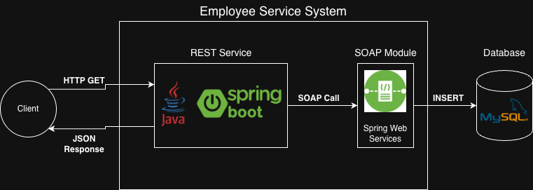
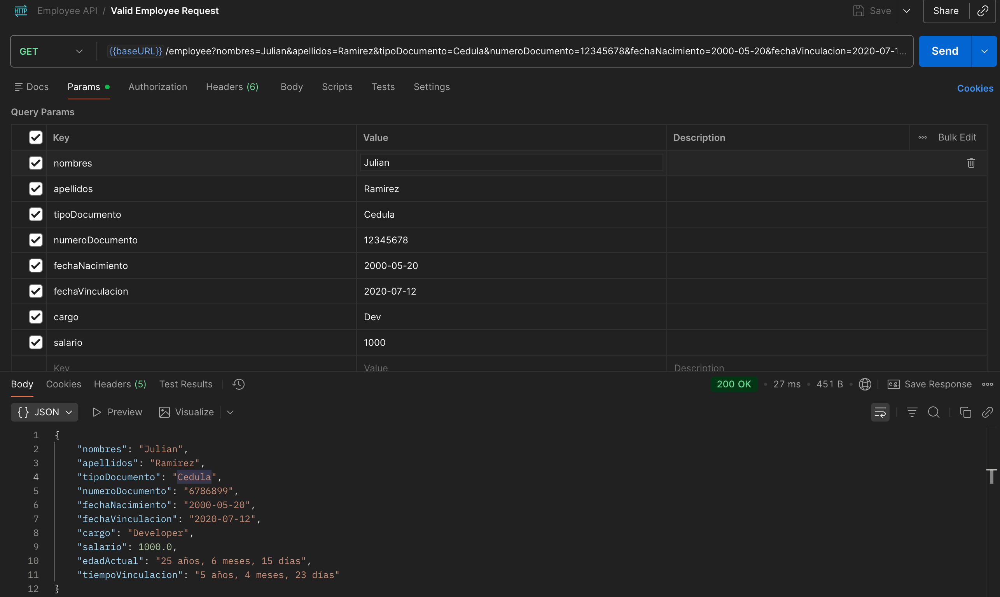
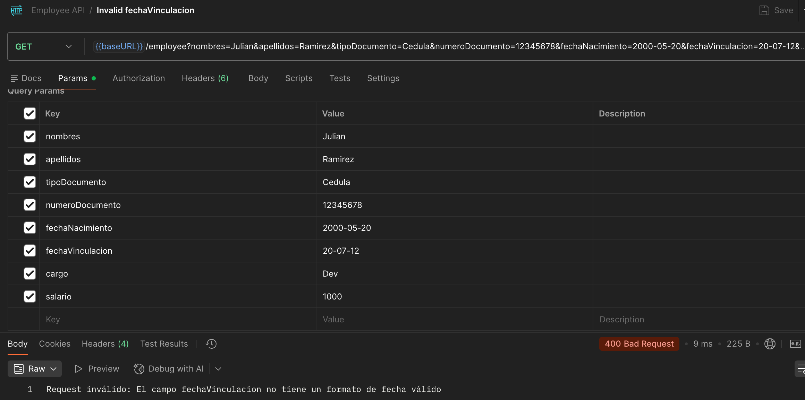
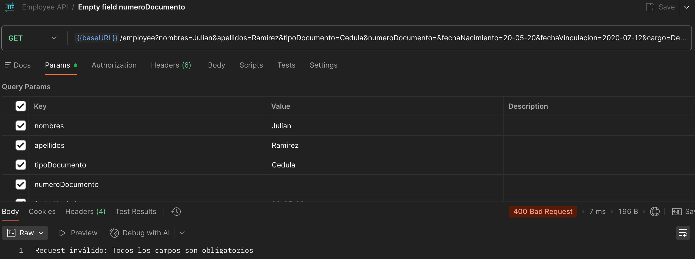
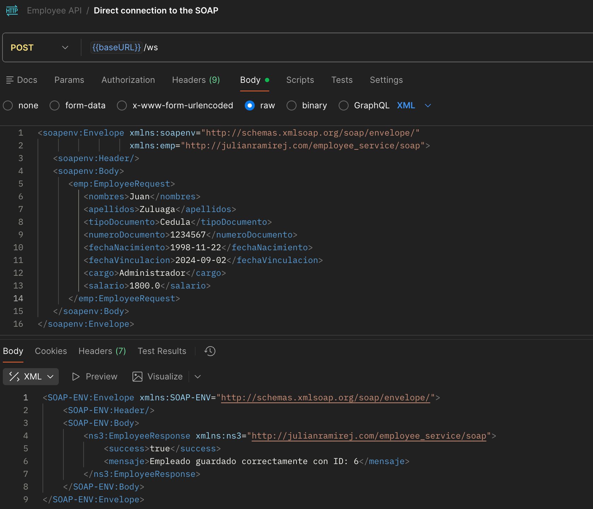

# Servicio Empleado - Prueba Técnica

## Descripción
Este proyecto implementa un servicio REST en Java (Spring Boot) que recibe los atributos de un empleado mediante el método GET,
realiza validaciones sobre algunos atributos. Específicamente se valida que estos atributos no sean vacíos, que las fechas tengan un formato válido 
y que el empleado sea mayor de edad. Además, se invoca un servicio SOAP interno que almacena la información en una base de datos MySQL.
Finalmente, el servicio responde con un JSON enriquecido con algunos datos calculados en base a los recibidos en la petición.

## Diseño 

El sistema expone un endpoint GET construido con Java Spring Boot. Este endpoint debe recibe los siguientes parámetros:
Nombres, Apellidos, Tipo de Documento, Número de Documento, Fecha de Nacimiento, Fecha de Vinculación a la Compañía, Cargo y Salario.

Después de recibir la petición, el servicio verifica:
 - Que ningún atributo llegue vacío.
 - Que las fechas tengan un formato válido.
 - Que el empleado sea mayor de edad (edad ≥ 18 años).
 - Que el salario no sea negativo.

Si alguna de estas validaciones falla, el servicio retorna un 400 – Bad Request.

Si todas las validaciones se completan correctamente, el servicio REST invoca un servicio SOAP interno,
pasando el objeto Employee. Este servicio SOAP se encargará de almacenar los datos del empleado en la tabla Employee de una
base de datos MySQL.

Finalmente, una vez la información haya sido almacenada, el servicio REST retornará un JSON con:
 - Los datos originales del empleado.
 - La edad actual del empleado.
 - El tiempo de vinculación.

A contiuación se presenta un diagrama con el diseño del proyecto:



### Estructura del proyecto

El proyecto `employee_service` está organizado en dos módulos principales que representan sus componentes centrales: 
la API REST y el servicio web SOAP. Cada módulo tiene responsabilidades bien definidas para mantener una arquitectura 
limpia y modular.

- **rest/**: Contiene los controladores REST (`controller`) que reciben las solicitudes HTTP y delegan la lógica al `service`.
Los DTOs (`dto`) definen el formato de los requests y responses, los modelos (`model`) representan las entidades principales 
del dominio, como `Employee`, los servicios (`service`) contienen la lógica de negocio y finalmente las v
validaciones (`validator`) aseguran que los datos cumplan con las reglas definidas antes de procesarlos.


- **soap/**: Incluye la configuración del servicio SOAP (`config`), los DTOs específicos para SOAP (`dto`) 
que definen la estructura de los requests y responses, los endpoints (`endpoint`) que exponen los servicios, 
las entidades (`entity`) que representan la estructura de persistencia en la base de datos y los repositorios (`repository`) 
que permiten realizar operaciones de acceso a datos.

### Base de datos

Se utiliza MySQL dentro de un contenedor Docker. La tabla principal employee tiene los siguientes campos:

| Campo             | Tipo      | Descripción            |
|------------------|-----------|------------------------|
| id               | BIGINT PK | Identificador único    |
| nombres          | VARCHAR   | Nombres del empleado   |
| apellidos        | VARCHAR   | Apellidos del empleado |
| tipo_documento   | VARCHAR   | Tipo de documento      |
| numero_documento | VARCHAR   | Número de documento    |
| fecha_nacimiento | DATE      | Fecha de nacimiento    |
| fecha_vinculacion| DATE      | Fecha de vinculación   |
| cargo            | VARCHAR   | Cargo del empleado     |
| salario          | DOUBLE    | Salario                |


La base de datos se crea automáticamente al levantar el contenedor de Docker usando el docker-compose.yml.


### Tests Unitarios

Como parte del proyecto y siguiendo buenas prácticas de desarrollo se incluyeron pruebas unitarias para funcionalidades como:

- Validaciones de campos obligatorios y formatos

- Cálculo de edad y tiempo de vinculación

- Lógica de invocación del servicio SOAP

Para ejecutar los tests se utiliza Maven: ``` ./mvnw test ```

## Ejecución del proyecto

Esta aplicación fue diseñada para que pueda ejecutarse fácilmente sin necesidad de instalar MySQL localmente.
El script run.sh se encarga de preparar todo el entorno, levantar los servicios y dejar la API lista para usar.

Para ejecutar el proyecto es necesario tener instalado: Java 17, Maven 3+ (opcional, el proyecto incluye Maven Wrapper ./mvnw), Docker (debe estar corriendo para levantar la base de datos),
Bash (para ejecutar el script run.sh).

El script run.sh incluye verificación de dependencias y del estado del Docker daemon antes de arrancar la aplicación.

### Pasos para ejecutar
-  Clonar el repositorio: ``` git clone https://github.com/JulianRamirezJ/technical-test-employee-service.git ```
-  Ir a la raiz del proyecto: ``` cd technical-test-employee-service ```
- Dar permisos de ejecución al script: ``` chmod +x run.sh ```
- Asegurarse de que Docker esté corriendo: ``` docker info ```
- Ejecutar el script: ``` ./run.sh ```
- El servicio REST quedará disponible en la URL http://localhost:8080/employee, además puede utilizar el archivo
  'Employee API.postman_collection.json' que está disponible en la raiz del proyecto como guía para probar a través de Postman.
- Este es un ejemplo de request con los parametros requeridos por la API: 
``` GET http://localhost:8080/employee?nombres=Julian&apellidos=Ramirez&tipoDocumento=Cedula&numeroDocumento=12345678&fechaNacimiento=2000-05-20&fechaVinculacion=2020-07-12&cargo=Dev&salario=1000 ```

- Y la respuesta de la API: ```{
    "nombres": "Julian",
    "apellidos": "Ramirez",
    "tipoDocumento": "Cedula",
    "numeroDocumento": "6786899",
    "fechaNacimiento": "2000-05-20",
    "fechaVinculacion": "2020-07-12",
    "cargo": "Developer",
    "salario": 1000.0,
    "edadActual": "25 años, 6 meses, 15 días",
    "tiempoVinculacion": "5 años, 4 meses, 23 días"
} ```


## Planeación inicial

Antes de empezar a implementar el proyecto se definieron unas tareas que sirvieron como guía para dividir responsabilidades 
y organizar el flujo de trabajo.
El proyecto se implementó siguiendo esta planeación, adaptándola según las necesidades de desarrollo:

1. Crear estructura base del proyecto.
2. Documentar el diseño del proyecto, las herramientas a utilizar y demás consideraciones iniciales.
3. Definir el modelo `Employee`.
4. Implementar el endpoint GET.
5. Implementar las validaciones.
6. Implementar el cálculo de la edad y el tiempo de vinculación.
7. Implementar la comunicación del servicio REST con el servicio SOAP.
8. Implementar el servicio SOAP.
9. Crear la base de datos e implementar la persistencia desde el servicio SOAP.
10. Agregar pruebas unitarias.
11. Ajustes finales y documentación.

## Notas adicionales

Este repositorio se irá construyendo progresivamente siguiendo buenas prácticas de desarrollo:

- Test unitarios para verificar las funcionalidades principales.
- Uso de ramas `feat/type-of-change(docs,rest,soap)/brief-description` para cada componente importante.
- Pull Requests para mantener la trazabilidad del trabajo.
- Commits con descripciones puntuales.
- Documentación general del proyecto.


## Adjuntos





